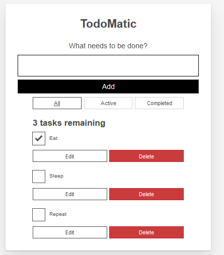

# Code together Todo in react

Setup Instructions 

1. npx create-react-app todo
2. `cd todo`
2. optional: delete a few files `cd src;rm -- App.test.js App.css logo.svg reportWebVitals.js setupTests.js`
   * note if you do this you will also have to remove imports & references to these
3. `mkdir src/components`
3. change the title in `public/index.html` to "Todo with React"
3. copy [app.starter.js](app.starter.js)  into  `src/App.js`  (remove comments `/*` `*/` & replace the default App function)
4. copy [index.starter.css](index.starter.css)  into  `src/index.css`  (replace the content)
5. copy [index.starter.js](index.starter.js) into `src/index.js` (replace the content)
6. now `npm run start`  make sure you see all of the fields  

Now you're ready to create components.
